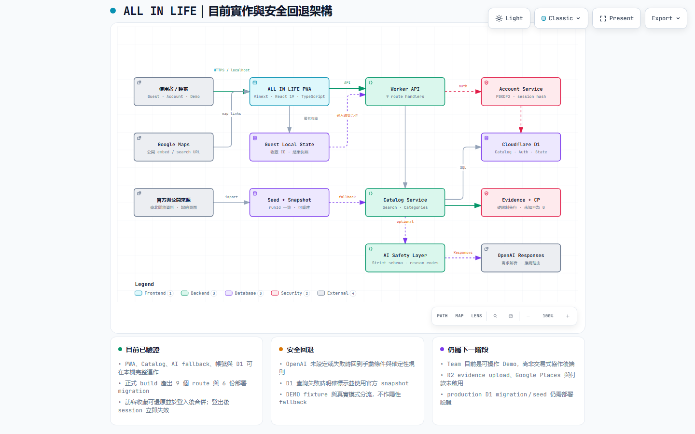
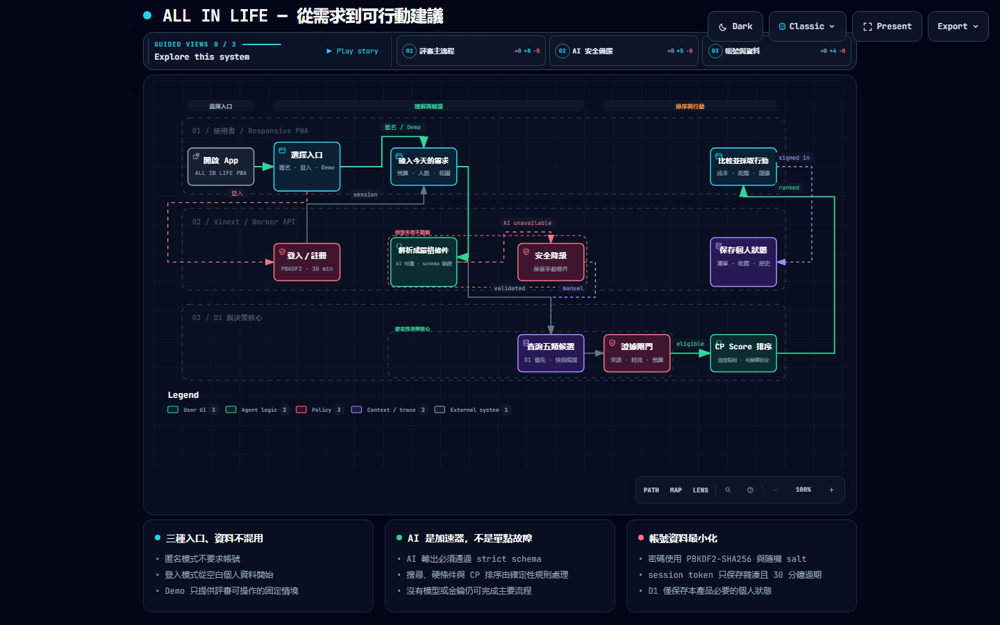

# ALL IN LIFE

> 圓山生活圈的 CP 值、零元機會與 Team 協作平台。

ALL IN 不是走投無路，而是因為有夢想，主動把金錢與心力投進真正想完成的事。ALL IN LIFE 幫使用者省下每一筆日常，把更多資源留給未來。

## 評審快速入口

| 項目               | 連結／狀態                                                                                               |
| ------------------ | -------------------------------------------------------------------------------------------------------- |
| HTTPS 展示站       | [all-in-life-ail.chiehlun.chatgpt.site](https://all-in-life-ail.chiehlun.chatgpt.site)（新版已公開上線） |
| PWA 驗收           | Chrome 已顯示「可安裝到主畫面」；manifest、icons、service worker 與離線 fallback 已驗證                  |
| 本次交付規格       | [`SPEC.md`](SPEC.md)                                                                                     |
| 官方作品繳交檢查表 | [`submission-checklist.md`](submission-checklist.md)                                                     |
| 系統架構           | [互動式架構圖](docs/architecture/all-in-life-architecture.html)                                          |
| 產品流程           | [互動式流程圖](docs/architecture/all-in-life-product-flow.html)                                          |
| 評選影片           | 待上傳；需不超過 2:00 並設為「知道連結即可觀看」                                                         |

目前展示以可操作前端與 PWA 為主；catalog 資料層已具備 D1 `DB` binding、本機自動 bootstrap，以及會回退官方 snapshot 的 API。主搜尋 UI 已用 `POST /api/catalog/search` 取得資料，切換分類、距離或所選時刻會重新查詢；D1 無法查詢時明確回退官方 snapshot。DEMO 固定情境與真實模式完全分流，正式模式 API 失敗時不會偷偷混入 fixture。新版候選已加入伺服器端 AI 需求解析與推薦理由；正式站需設定環境變數並重新部署才會啟用，登入與交易式資料仍是下一階段。

ALL IN LIFE 是一個以「限制優先、證據可追溯、成本不造假」為原則的圓山生活決策 App。使用者可匿名直接使用，或選擇登入以銜接日後的跨裝置保存；文字與語音都會進入同一份可編輯的結構化需求，再比較餐飲、日用、育樂與交通選項。

目前版本是可操作的手機 App 型前端，共 16 個畫面：首次設定、首頁、搜尋、結果、詳情、清單、揪團、設定、個人檔案、篩選、通知、消費分析、歷史、回報與地圖等。它包含頁面轉場、語音／文字輸入、前端搜尋載入演出、收藏與到期提醒、標記已買、預算統計、分享及成團成本比較。catalog API、本機 D1 與主搜尋 UI 已接上；帳號驗證、Team／交易式後端與 production D1 seed／部署尚未完成。畫面會逐筆標示「DEMO 模擬」、「已驗證範例」、「地點已驗證」或「活動已驗證」；只有 evidence 支撐的欄位才顯示勾勾。真實來源沒有價格時仍顯示「價格待確認」，不會推算成零元或虛構 CP 分數。

## 問題與目標

低預算生活決策不只是找最低標價。交通、份量、資格、時間、最低成團人數與資料可信度，都可能讓看似便宜的方案變得不可用。現有搜尋服務通常把這些條件分散在不同頁面，使用者還需要自行判斷資料是否過期。

ALL IN LIFE 的目標使用者是學生、剛進入職場者、精打細算的在地居民，以及希望一起湊優惠的小型熟人團體。產品先排除不符合硬限制或缺乏必要證據的候選，再用可解釋的 CP Value 分數排序，讓使用者知道一個選項為什麼值得選、資料從哪裡來，以及仍有哪些未知成本。

## 核心功能

- 首次設定 SOP：匿名可直接使用，登入後可保存；先設定暱稱、頭像、預算、硬限制與偏好。
- 統一需求編輯器：語音和文字共用日期、時段、類別、預算、人數、距離、排除與偏好欄位。
- 五類任務結果：食品、日用品、免費／公益資源、活動、交通，支援成本、距離、營業時間與服務方式比較。
- 勞動錯覺搜尋介面：以計時器和狀態管理逐步顯示來源、限制、成本與證據檢查。
- CP Value Engine：綜合價格、食物、品質、便利與折扣五個維度，再以可靠度及資料覆蓋率修正。
- Evidence Gate：缺少必要證據、違反硬限制或資料覆蓋不足時，不產生可比較分數。
- 可追溯結果：顯示來源、查核時間、適用條件、可信度與評分原因。
- 圖片可信原則：只有可確認來源與使用權的真實照片才顯示；沒有真實圖片時，以類別色塊與圖示呈現，不使用示意照冒充店家或商品實景。
- Team 揪團：呈現餐點內容、成團門檻、單獨／成團人均、承諾人數、分享與門檻前取消。
- 個人中心：可修改匿名暱稱與頭像，查看通知、收藏到期提醒、歷史與消費分析。
- 地圖與清單：內嵌 Google Maps 搜尋結果，並提供外部地圖連結；目前不提供導航。
- 語音輸入：在支援 Web Speech API 的瀏覽器中，可用繁體中文輸入需求。
- 響應式 PWA 外觀：提供 manifest、SVG app icon、手機底部導覽與桌面版配置。

## 目前完成度

| 能力                | 狀態                        | 說明                                                                                                       |
| ------------------- | --------------------------- | ---------------------------------------------------------------------------------------------------------- |
| 手機 App 多畫面介面 | 可操作                      | 16 個 state-driven screens 集中在 `mvp/app/page.tsx`，固定導覽且只捲動內容區                               |
| CP Value 計算       | 可操作                      | 純 TypeScript 規則引擎，包含 evidence、hard constraint 與 coverage gate                                    |
| 官方來源資料        | D1／API 可查詢              | 13 個官方來源可重建；catalog API 優先查 D1，未配置或失敗時回退官方 snapshot                                |
| Google 地圖         | Demo                        | 使用公開 embed/search URL，尚未串 Places API 或儲存 Place ID                                               |
| 搜尋流程            | API 已接 UI                 | 真實模式以 POST 查 catalog；活動查所選時刻起 7 天，分類、距離、時刻與模式改變會重查；DEMO 使用完整固定範例 |
| Team 多人協作       | 設計／Demo                  | UI 與 D1 schema 已備妥，尚無登入、邀請與交易式後端                                                         |
| Cloudflare D1       | binding／本機 runtime ready | hosting config 已使用 `DB`；`predev`／`prestart` 會自動套 migration 並同步最新 seed 至本機 D1              |
| PWA                 | 已公開驗收                  | HTTPS、manifest、192/512 icons、service worker、Chrome installability 與離線 app-shell fallback 已驗證     |

## 系統架構



目前可執行路徑包含 Vinext / React 前端、記憶體狀態、CP Value Engine、Google Maps embed、D1-backed catalog API，以及伺服器端 AI 條件解析／推薦說明；版本庫內 DEMO 是獨立固定情境，不作正式模式的隱性 fallback。真實候選少於 3 筆時可在獨立區塊顯示 DEMO 補充，且不計入真實筆數。下圖中的帳號／Team Worker API、R2 與 Team Intelligence 仍是下一階段目標架構；詳細資料表、API contract、freshness 與 evidence 規則請參考 [`docs/SPEC-team-cp-zero-cost-v1.md`](docs/SPEC-team-cp-zero-cost-v1.md)。

資料處理原則：

1. 將使用者輸入解析成預算、人數、區域、硬限制與軟偏好。
2. 付費與零成本來源分流產生候選。
3. 正規化價格、份量、資格、有效期限與來源證據。
4. 先套用 Evidence Gate 與硬限制，再計算 CP Value。
5. 以可靠度與覆蓋率修正分數，回傳可解釋的排序與來源。



文件導覽：

- [本次送件與部署規格](SPEC.md)
- [互動式產品流程圖](docs/architecture/all-in-life-product-flow.html)
- [互動式系統架構圖](docs/architecture/all-in-life-architecture.html)
- [目前分支與 main 的架構、語言與衝突比較](docs/branch-main-comparison.md)
- [Team / CP / Zero-Cost 技術規格](docs/SPEC-team-cp-zero-cost-v1.md)
- [API、登入與資料持久化串接規劃](docs/API-integration-plan.md)
- [BUILDMODE 送件 checklist](submission-checklist.md)

## 使用技術

| 類型         | 技術／服務                                     | 用途與目前狀態                                                                                          |
| ------------ | ---------------------------------------------- | ------------------------------------------------------------------------------------------------------- |
| 前端         | React 19、TypeScript 5、Vinext、Tailwind CSS 4 | 手機 App shell、多畫面狀態導覽與 Cloudflare 相容建置                                                    |
| UI           | Base UI、shadcn、Lucide React                  | Dialog、Tabs、Slider、按鈕與 icon                                                                       |
| 評分         | 自製 CP Value Engine                           | 五維加權、可靠度修正、證據與覆蓋率守門                                                                  |
| 語音         | Web Speech API                                 | 瀏覽器端 `zh-TW` 語音辨識；不支援時回退文字輸入                                                         |
| 地圖         | Google Maps embed / search URL                 | Demo 地圖與外部查詢；尚未使用付費 Places API                                                            |
| 後端         | Cloudflare Workers                             | `/api/catalog/search` 與 `/api/catalog/categories` 已實作；帳號、Team 與寫入 API 尚待完成               |
| 資料庫       | Cloudflare D1 / SQLite                         | `DB` binding、四份結構 migration、13-source importer、本機自動 bootstrap、SQLite／seed／snapshot 已完成 |
| 物件儲存目標 | Cloudflare R2                                  | 規劃存放證據照片與收據；目前未啟用                                                                      |
| 部署         | OpenAI Sites + Cloudflare toolchain            | 新版已發布到公開 HTTPS 展示站                                                                           |
| AI 模型      | OpenAI Responses API（預設 `gpt-5.6-luna`）    | 只在伺服器解析條件、選擇有事實支持的理由代碼；缺 key／逾時／錯誤時回退手動與規則流程                    |

## 專案結構

```text
.
├─ README.md                         # 專案入口與重現說明
├─ submission-checklist.md           # BUILDMODE 送件前逐項檢查
├─ docs/
│  ├─ PRD-all-in-life.md             # 產品需求
│  ├─ SPEC-all-in-life-mvp.md        # MVP UI / UX 規格
│  ├─ SPEC-team-cp-zero-cost-v1.md   # Team、CP、D1 與 evidence 技術規格
│  └─ architecture/                  # 架構圖、流程圖與可檢視 HTML
└─ mvp/
   ├─ app/                           # Vinext App Router 頁面、layout、manifest
   ├─ components/ui/                 # UI 元件
   ├─ data/                          # 官方資料 seed、精簡快照與使用說明
   ├─ db/schema.ts                   # Domain type 與資料表名稱
   ├─ drizzle/                       # D1 / SQLite 核心、產品流程與匯入稽核 migrations
   ├─ lib/cp-engine.ts               # CP Value 規則引擎
   ├─ scripts/                       # 官方資料匯入與本機資料庫驗證
   └─ public/                        # PWA icon、service worker、架構頁
```

## 安裝與執行

### 環境需求

- Node.js `22.13.0` 以上、`24` 以下（Windows 建議使用 Node 22 LTS）
- npm（隨 Node.js 安裝）
- 建議使用最新版 Chrome、Edge 或 Safari；語音辨識支援度依瀏覽器而異

### 本機開發

```bash
git clone https://github.com/TingGeorge/AIL.git
cd AIL/mvp
npm ci
npm run dev
```

開啟終端機顯示的本機網址，通常是 `http://localhost:3000`。若要讓同一區域網路的手機測試：

```bash
npm run dev:lan
```

`npm run dev`、`npm run dev:lan` 與 `npm run start` 會透過 npm 的 pre-script 自動執行 `npm run data:bootstrap:local`：首次建立本機 D1 時依序套用三份核心 migration、同步目前 snapshot 對應的 seed，並補上 AI 限流 migration；資料已是相同 `runId` 時不會重複灌入。本機狀態保存在 `mvp/.wrangler/state`。

接著用手機開啟電腦的區網 IP 與終端機顯示的 port。Windows 防火牆可能會要求允許 Node.js 的私人網路連線。

### 品質檢查與正式建置

```bash
cd mvp
npm run lint
npm run build
```

如需檢查格式，可執行 `npm run format -- --check`。建置輸出位於 `mvp/dist/`；完成 build 後可用下列指令啟動 Cloudflare 本機 runtime：

```bash
npm run start
```

Windows 上的 Node 24 目前可能在 Vinext 已完成輸出後觸發 libuv `UV_HANDLE_CLOSING` assertion；請使用 Node 22 LTS，以免成功建置被回報為非零結束碼。

Demo 不需要 `.env` 或 API key。真實模式若要啟用 AI，請在本機忽略的 `mvp/.dev.vars` 或 Sites 環境變數設定 `OPENAI_API_KEY` 與 `OPENAI_MODEL`；金鑰只能放在 server-side secret，絕對不要提交到 Git 或使用 `NEXT_PUBLIC_*`。

### 官方資料庫快照

以下指令會從 13 個官方來源重新擷取圓山站 2 公里資料，產生本機 SQLite、可套用至 D1 的 seed SQL 與精簡 JSON，並檢查完整性、外鍵、範圍與「不虛構價格／營業狀態」守門：

```bash
cd mvp
npm run data:refresh
npm run db:verify
npm run data:bootstrap:local
```

詳見 [`mvp/data/README.md`](mvp/data/README.md)。產生的 SQLite 不進 Git；seed 是本機 D1 的 bootstrap，snapshot 同時是 catalog API 在 binding 未配置或查詢失敗時的 fallback。bootstrap 會核對 seed 與 snapshot 的 `runId`，API 也只回傳最新一筆 `COMPLETED` import run 中標為 `IMPORTED` 的項目。hosting config 已宣告 D1 `DB`，但 production seed 與部署仍未完成。日用品結果只納入臺北市官方藥局；友善店家清冊仍會抓取及稽核，但因不能證明零售業態，不再建立為零售／日用品候選。

### API 與 D1 runtime

`mvp/drizzle/0001_p0_core.sql` 定義核心資料模型，`0002_product_flow.sql` 補上搜尋需求、清單、通知、購買紀錄與揪團品項，`0003_open_data_ingestion.sql` 加入來源資源與匯入稽核，`0006_ai_rate_limits.sql` 提供不保存原始 IP 的 AI 原子限流。本機啟動前會自動執行 `data:bootstrap:local`。主搜尋使用 `POST /api/catalog/search`，避免把精確位置放在 URL；`GET` 仍保留供手動檢查，`GET /api/catalog/categories` 提供類別摘要。查詢優先讀取 D1 最新完成匯入，失敗時改讀官方 snapshot；活動預設回傳所選時刻起 7 天內仍有效或即將開始的項目，並區分 `CURRENT`／`UPCOMING`。完整 API 順序、資料契約、匿名轉登入與外部服務策略請見 [`docs/API-integration-plan.md`](docs/API-integration-plan.md)。

## 作品展示

- 公開展示網址：[https://all-in-life-ail.chiehlun.chatgpt.site](https://all-in-life-ail.chiehlun.chatgpt.site)（新版已公開上線）
- 評選影片：待上傳後補上（需不超過 2:00，且設為知道連結即可觀看）
- 本機展示：依上方「安裝與執行」使用 `npm run dev`

建議 Demo 順序：省錢晚餐 → 查看 CP 分解與 evidence → Team 團購門檻 → 白嫖一天 → 地圖／來源連結。完整送件狀態請看 [`submission-checklist.md`](submission-checklist.md)。

## 限制與未來工作

- 主搜尋已讀取 catalog API；D1 失敗時會標示 snapshot fallback，整個 API 無法連線時正式模式顯示錯誤，不會自動混入 DEMO。資料不代表即時價格、庫存或成團承諾；未知價格會顯示待確認，使用前仍須回原始來源查核。
- 目前沒有登入、持久化 Profile、真實 Team 邀請、承諾交易或併發控制。
- 已有受控的 13-source 官方資料 importer、catalog API、D1 `DB` binding 與伺服器端 AI 解析／推薦說明，但沒有店家即時菜單／庫存來源、帳號／交易 API 或 R2 evidence upload。
- 本機 D1 seed／bootstrap 已完成，但 production seed 與部署尚未完成；增量撤站、活動下架與過期 reconciliation 也尚未實作。
- 官方資料 importer 有 2 km 直線距離篩選；Google 地圖介面仍採 embed/search URL，沒有 Places attribution pipeline 或路線導航。
- 語音辨識依賴瀏覽器能力，結果不會上傳至本專案後端，但瀏覽器供應商可能依其政策處理語音。
- Chrome 已確認觸發 PWA installability，service worker 與離線 app-shell fallback 亦已驗證；正式送件前仍建議在目標 Android／iOS 實機各完成一次安裝與飛航模式重載。
- CP 分數使用 Demo 維度值；正式上線需加入 cohort normalization、policy version、freshness 與 score audit。
- Community report、食安事件與商家合作需先完成 moderation、隱私、濫用防護及法務規則。

下一步優先順序為：完成 production D1 seed／部署驗證 → 完成登入及 Team transaction → Google Places 合規整合 → PWA / accessibility / offline 驗收 → 正式監控。

## 第三方服務、資料與素材

| 項目               | 來源                                                                                                                                                                                                                                                                                                                                                                  | 用途／授權或使用說明                                                                                                                 |
| ------------------ | --------------------------------------------------------------------------------------------------------------------------------------------------------------------------------------------------------------------------------------------------------------------------------------------------------------------------------------------------------------------- | ------------------------------------------------------------------------------------------------------------------------------------ |
| npm 套件           | 各套件 registry / repository                                                                                                                                                                                                                                                                                                                                          | 依各套件授權；完整版本鎖定於 `mvp/package-lock.json`                                                                                 |
| Google Maps        | [Google Maps](https://www.google.com/maps)                                                                                                                                                                                                                                                                                                                            | 使用公開 embed 與 search URL；受 Google Maps 條款約束，不在本 repo 儲存 map tiles                                                    |
| 臺北市資料大平臺   | [餐館業清冊](https://data.taipei/dataset/detail?id=178abc4e-fe32-4fc9-af3a-7baf1c15082c)、[臺北市藥局](https://data.taipei/dataset/detail?id=6fa3ed67-e60e-44d9-a366-ce7008e322de)、[YouBike](https://data.taipei/dataset/detail?id=c6bc8aed-557d-41d5-bfb1-8da24f78f2fb)、[臺北文化快遞](https://data.taipei/dataset/detail?id=9a7af75b-9abd-4ac1-b359-685fbd7dac23) | 13 個來源構成圓山 2 km 地點與活動快照；依[政府資料開放授權條款第 1 版](https://data.taipei/rule)標示來源。文化快遞投稿事實預設未驗證 |
| 臺北市立美術館     | [時間與票價](https://www.tfam.museum/Common/editor.aspx?ddlLang=zh-tw&id=230)                                                                                                                                                                                                                                                                                         | 展示票價／免費條件的來源連結；內容權利屬原發布者                                                                                     |
| 臺北孔廟／花博公園 | [孔廟參觀資訊](https://tct.gov.taipei/News_Content.aspx?n=E1DAB7270307AF9D&s=4A373EEBD86D5BF6&sms=87415A8B9CE81B16)、[花博本週活動](https://www.expopark.taipei/News_Content.aspx?n=91&s=4542&sms=9004)                                                                                                                                                               | 只保存可核對的開放／活動條件、短摘與原始連結                                                                                         |
| 臺北典藏植物園     | [臺北市政府公開頁面](https://english.udd.gov.taipei/News_Content.aspx?n=DD9CEC17A97FBC64&s=40E52F644FD67A6C&sms=72544237BBE4C5F6)                                                                                                                                                                                                                                     | 展示免費導覽資訊的來源連結；出發前需再查核                                                                                           |
| 字型               | Geist / Geist Mono                                                                                                                                                                                                                                                                                                                                                    | 由應用程式框架載入；依其 SIL Open Font License 使用                                                                                  |
| Icons              | Lucide                                                                                                                                                                                                                                                                                                                                                                | ISC License；用於介面圖示                                                                                                            |
| 架構圖             | 本專案產製                                                                                                                                                                                                                                                                                                                                                            | 原始 JSON、HTML 與 PNG 位於 `docs/architecture/`                                                                                     |
| DEMO 固定情境      | 本專案程式碼                                                                                                                                                                                                                                                                                                                                                          | 與真實模式分流；數量不足時只在獨立補充區顯示，不計入真實筆數或冒充商業事實                                                           |

本儲存庫不應包含 API key、Token、密碼、真實個資或未授權的使用者證據照片。第三方內容只保留必要短摘、canonical URL、查核時間與授權／保留政策。

## 團隊成員

| 姓名               | Email                                                     | 大致分工                                               |
| ------------------ | --------------------------------------------------------- | ------------------------------------------------------ |
| 丁肇志（Ting）     | [conanlong911@gmail.com](mailto:conanlong911@gmail.com)   | 產品方向、核心流程、語音輸入、PWA 與 Demo 串場         |
| 林軒緯（緯）       | [xuanweilin805@gmail.com](mailto:xuanweilin805@gmail.com) | 前端協作、互動與跨裝置測試、部署驗收                   |
| Andrew Fai（AF）   | [andydrewie@gmail.com](mailto:andydrewie@gmail.com)       | 資料來源整理、Evidence 驗證、影片錄製與備援素材        |
| 楊杰倫（Jay Yang） | [cl.yang04@gmail.com](mailto:cl.yang04@gmail.com)         | CP / Team / Zero-Cost 規格、README、送件文件與發布整合 |

分工是送件用的大方向，實際工作可互相支援。正式送件前請由主要聯絡人確認表單上的姓名、Email 與最終分工一致。

## License

目前儲存庫尚未加入 `LICENSE`，因此預設保留所有權利，不能視為開源授權。送件前請由專案權利人選定授權（例如 MIT）並在根目錄加入明確的 `LICENSE` 檔案；此項已在 checklist 標為未完成。
