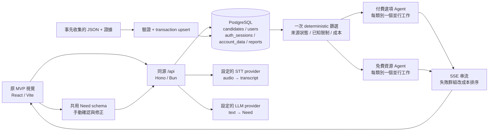

# UI × main 後端整合紀錄

日期：2026-09-05。新分支：`codex/integrate-mvp-ui-main-backend`。

## 1. 來源與優先順序

| 來源 | 版本 | 如何使用 |
|---|---|---|
| `origin/codex/all-in-life-mvp` | `39148e9` | 視覺、版面、圖示、品牌與主要畫面互動；不是直接執行其 Vinext／Cloudflare runtime |
| 本機 `main` | `cd1767c` | Bun/Hono/Vite、共用 Need/Rec、SQL、匯入、證據閘門與 SSE 基礎 |
| `origin/main`（整合開始時） | `45f57ed` | 已包含於上述本機 main，不覆蓋本機較新的 SSE commit |
| `docs/SPEC-backend.md` | 優先後端契約 | 五類資料、兩個推薦 Agent、帳號私有資料、商家團體優惠 |
| `docs/SPEC-voice-input.md` / `SPEC-geocoding.md` / `SPEC-ingestion.md` | 專項契約 | 逐字稿確認、不猜未知值、定位同意、資料與證據匯入 |

採 **UI 移植＋契約對齊**，不是把兩個 `package.json` 或兩套伺服器硬合併。舊 `screens/`、`mockResults.ts` 只作歷史參考；目前 `main.tsx → App.tsx` 沒有 import 它們。

## 2. 串接架構



搜尋不即時爬網頁；模型不能新增、刪除或假造候選。伺服器驗證模型 id、補回遺漏項目、拒絕不可信理由。前端按類別、paid/free 群組接收事件，不依完成時間排列；同類別預設名次交錯，生存模式免費在前。

## 3. 畫面 → API → 持久資料

| UI | API | 資料／責任 |
|---|---|---|
| 首頁能力狀態 | `GET /api/config` | 只揭露設定有無，不回傳 key；`database:true` 不代表 DB readiness |
| 首頁資料涵蓋 | `GET /api/catalog` | 實際 DB 的五類筆數、可排序／待確認、最近確認時間；預設不公開 demo／封存資料 |
| 語音按鈕 | `POST /api/transcribe` | multipart 音訊；上限 5 MiB、30 秒錄音；只回逐字稿 |
| 解析、修正 | `POST /api/parse` | `{transcript,current}` → 同一份 Need；送出前可手動修正 |
| 確認搜尋 | `POST /api/search` | `{need,exclude,location,costco_ok}`；`text/event-stream` |
| 詳情／收藏還原 | `GET /api/candidates?ids=...`；`GET /api/candidates/:id` | 使用候選真實 id；不存在項目明示，可移除；單次最多 200 ids |
| 註冊／登入 | `POST /api/auth/register`、`login` | Argon2id；回 user/data/session_token/expires_at |
| 登入還原／登出 | `GET /api/auth/me`；`POST /api/auth/logout` | Bearer token；固定 30 分鐘、DB 只存 SHA-256 token hash |
| 改密碼 | `POST /api/auth/change-password` | 驗證舊密碼、鎖定使用者並重驗工作階段；撤銷所有 session |
| 收藏／清單／設定 | `GET`、`PUT /api/me/data` | 只允許 list/favs/settings/profile；nickname 以 users 為唯一來源 |
| 回報 | `GET`、`POST /api/candidates/:id/reports` | 可公開讀取，寫入需登入；七種原因，不自動改資料狀態 |
| 團體優惠 | 候選 `group_offer` | 真實碼、門檻與試算；沒有 join/team-members 假 API |

### SSE 事件

1. `step: filter`：總候選、通過數、各限制排除計數、paid/free 群組數與 warnings。
2. `(agent, category, status: ranking)`：某群組开始。
3. `(agent, category, status: done | failed, records)`：可交錯完成；failed 保留成本排序與空推薦理由。
4. `step: done`：pending、excluded 與完整警告；缺 final done 的串流視為部分結果。

唯一事件型別在 `src/shared/search.ts`。Warnings 是 `{code,fields,message}` 物件，不是字串；UI 顯示 `message`，避免把物件直接當 React child。

## 4. 差異與衝突怎麼解

| 差異／原風險 | 本分支處理 | 尚未涵蓋 |
|---|---|---|
| Vinext / Cloudflare 與 Bun/Hono 同時存在 | UI 改為普通 React component，單套 Vite/Bun runtime；保留原始視覺 CSS、Lucide 與 app icons | 不支援將 Bun SQL 直接部署成 Cloudflare Worker |
| 前端 fixture 形狀 vs 後端 Rec | 移除有效路徑上的假資料，真實 id 查詢、null/來源/份量直顯 | 未補造圖片或不存在的欄位 |
| 三個模式 vs 五個資料類別 | 日常／優惠／零元保留為體驗入口；資料類別依後端五類，free_only 獨立。`target_categories` 依語音規格 §3 只調整結果頁順序與初選；仍搜尋五類。手動模式允許只選類別啟動搜尋 | 目標類別不是硬限制；零筆也不偷偷切換其他類別 |
| 假計時器／CP 分數 vs 真實搜尋 | 真正 SSE 進度、分組 LLM 排序／fallback；不呈現虛構 CP 數字 | 外部模型品質仍需 live provider 驗收 |
| 匿名收藏 vs 私有帳號資料 | 收藏／清單需登入；匿名只有 sessionStorage 設定，登入不合併匿名資料 | 多裝置同時 PUT 是最後寫入優先 |
| 假支出圖 vs 有證據支出 | 自填月支出；非 demo 且成本已知時可「標記已買」，不是付款 | 無銀行連接、無交易歷史 |
| 揪團加入／假成員數 vs 商家優惠 | 顯示商家條件、兌換碼、試算；不假裝已加入團體 | 無真正團隊／聊天／付款系統 |
| 無法確定人數／日期／資格／過敏原 | 顯著警告；不宣稱完全符合，不猜測缺少標籤 | 需擴充資料欄位與來源證據才能精準篩選 |
| 範例資料有「已驗證」欄位 | 原有 fixture 保留但 API 預設隱藏；demo 模式需明確開啟且禁止導購/地圖/兌換/標記已買 | 真實資料的來源與必要費用另做匯入驗證 |
| localhost session 與 service worker | API no-store；只快取公開 app shell；拒絕未完成 SSE；加入 ErrorBoundary | 未做完整跨瀏覽器 PWA 安裝驗收 |
| 密碼變更與登入並行 | 使用者 row lock、重驗 password hash/session，防止舊密碼在撤銷後建立新 session | 公開環境需邊界限流、監控與備份 |
| 匯入半成功／誤上示範資料 | 預設 `data/live`；先驗證整批，再 transaction upsert；來源、未來查核時間、座標證據與未知費用檢查 | 舊 fixture 不刪除，API 預設隱藏 |

## 5. 隱私及部署邊界

- 只存帳號、清單／收藏 ids、設定、暱稱／顏色與回報。不存錄音、逐字稿、Need、搜尋歷史與使用者座標。
- token 在 sessionStorage；匿名設定也只在該分頁 sessionStorage。沒有 guest → account 自動合併。
- 若設定 AI provider，逐字稿／必要候選內容會送到該 provider；本應用不等於該 provider 的資料保留承諾。座標只在 deterministic 距離計算使用。
- 同源 API 不使用 cookie，不需要開放任意 origin CORS。Bun production 在 `prototype-v1` 工作目錄執行，靜態檔案為 `dist`。
- 資料庫及 key 放 server env，不提交 `.env`；使用 HTTPS。公開部署請另外設 edge 限流（含註冊、語音及搜尋成本）、DB 備份與監控。
- `/api/health` 是程序存活檢查，不是資料庫／模型 readiness 檢查。只設了變數不代表 provider 可呼叫。

## 6. 驗證紀錄與未驗證項目

本機隔離 PostgreSQL、停用真實 provider，執行型別檢查、全套測試與 production build。測試涵蓋帳號隔離／撤銷／並行改密碼、欄位白名單、body 大小、匯入、SSE、ranking fallback、UI 渲染、示範隔離、Need 邊界與支出。

第一階段（隔離 fixture 資料庫）瀏覽器實際走訪：註冊、登入、設定儲存及重整還原、手動搜尋、結果分類、示範警告、收藏／清單、詳情與共享回報。亦驗證登出清除個人狀態、重新登入還原清單與預算、390px 手機／1366px 桌面版面，以及 HTML 圖表篩選／流程切換。開發指令的 API 代理與 Ctrl-C 結束亦經測試。

2026-09-05 最終驗證：**128 pass / 6 skip / 0 fail**（745 assertions），型別檢查、production build 與 `git diff --check` 通過。GitHub Actions 是否成功需以遠端工作流程結果為準。

### 最後一輪真實資料驗收

| 驗收項目 | 2026-09-05 實測結果 |
|---|---|
| `data:validate` → `db:import` → `data:check` | 40 筆交易匯入；39 公開、37 可比較、2 待確認、1 封存；原 10 筆 fixture 保留但隱藏 |
| 五類公開／可比較數 | 食品 8/8、日用品 7/7、免費公益 7/7、活動 9/7、交通 8/8 |
| 清冊 | 5 個檔案 SHA-256、41 個來源／證據 URL、11 筆來源座標；`assessed_at` 使用目前時間，不把歷史查核時間當作當前有效期 |
| HTTP／SSE smoke | 一般／零元搜尋通過；五類 ranked/pending/excluded 筆數一致、ID 無遺漏或重複、13 筆零總成本、逐類抽查詳情與證據、示範隔離 |
| 快取隱私 | API（含 SSE）統一 `Cache-Control: no-store`；避免串流 helper 將它覆寫成較弱的 no-cache |
| 真實 DB 瀏覽器唯讀驗收 | 匿名手動搜尋、類別優先、活動 7 主候選＋2 待確認、IKEA 必要運費、公共服務資格、零元搜尋、來源詳情；未在實際 DB 新建測試帳號 |
| 版面 | 390px 手機與 1366px 桌面，頁面寬度無水平溢出；類別列和 HTML 圖表／表格可在區塊內橫向捲動 |

未知費用的詳情不顯示免費；「明確折扣 0」及「必要費用 0」用 NT$0 金額呈現，不以 FREE 誤導。所有資料仍是有限研究快照，不是即時可用性承諾；尚未公開部署。

**不當作已驗證：** 真實麥克風／STT 正確率、真實 LLM 語意品質、使用者真實定位、跨裝置 PWA 安裝與離線升級、公開生產部署。6 個 live-provider 解析測試在無 provider 設定時 skip；其他 fallback 與安全行為可獨立驗證。


## 7. 真實來源資料管線（2026-09-05 更新）

```text
官方／提供者公開網頁
  → 人工研究與短摘錄（docs/research）
  → data/live/*.json：一筆一來源，附 research_batch
  → prepareCandidate：schema、公開 HTTPS、時間、費用、座標證據
  → readCatalog：整批與重複 ID 驗證
  → PostgreSQL 原子 upsert（不刪既有資料）
  → publicRecords：預設排除 demo／archived
  → /api/catalog 覆蓋摘要 + /api/search 證據閘門／SSE
  → 結果／詳情呈現份量、資格、運費與研究限制
```

- `mandatory_fees_twd` 在來源 schema 必填，資料庫不再預設 0，現在可為 `null`；不知道費用不等於零，不能排入可比較主結果，也不能「標記已買」。
- 非示範資料須明填必要費用；來源必須為公開 HTTPS，查核時間不能在未來。缺份量、時間、必要證據的資料不能宣稱已驗證。
- 座標只接受附公開來源 URL、成對臺灣範圍座標與地址的 `extra.source_coordinates`，由 importer 提升至 DB `lat/lng`。無來源就維持未知，不猜位置。
- **相對原 PRD 的範圍差異：** 主要生活圈仍是圓山／大龍峒／花博；本批另外收錄兩個士林場館作為明示的延伸選項。首頁標題、涵蓋摘要與候選範圍均明示，不將它們稱為圓山步行範圍。這是資料涵蓋擴充，不代表原先固定圓山範圍已完整蒐集；位置／路程未知仍保留未知。
- 人工資料快照不會自動更新；`valid_until: null` 表示來源未明示期限，不是永久保證有效。查核方法、範圍、各類缺口見 `research/README.md`。
- `data:validate` 離線檢查來源檔的欄位與五類筆數門檻；`data:check` 對實際 DB 做同樣检查。它們不是爬蟲，也不把 HTTP 成功當作人工來源驗證。
- 原有故意矛盾／過期的合成案例仍在 `data/食品.json` 與單元測試；不製造真實商家矛盾案例來充數。
- `API_URL=http://127.0.0.1:3000 bun run data:smoke` 對啟動中的 App 做唯讀 HTTP 驗收：五類 SSE、免費成本限制、證據詳情、catalog 數量一致與示範隔離。
- CI 明確匯入 fixture 執行隔離測試後，再匯入真實資料、啟動 build 並執行同一份 HTTP smoke 驗收。遠端是否成功需以實際 Actions 執行結果為準。
